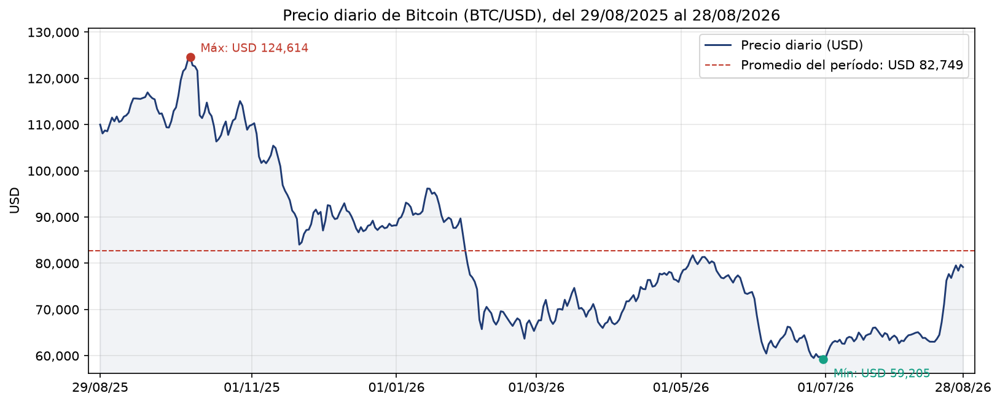
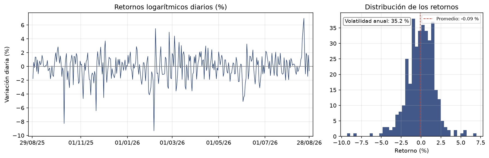
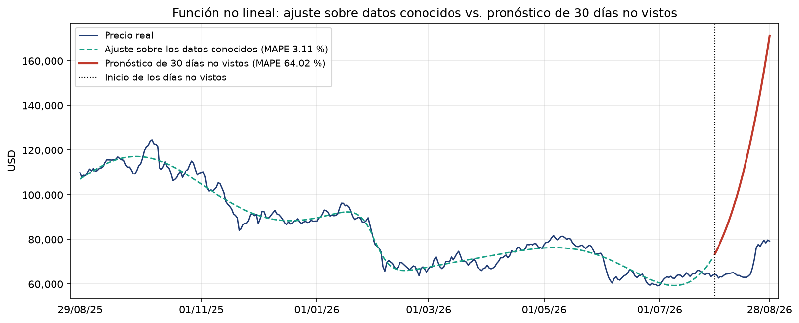
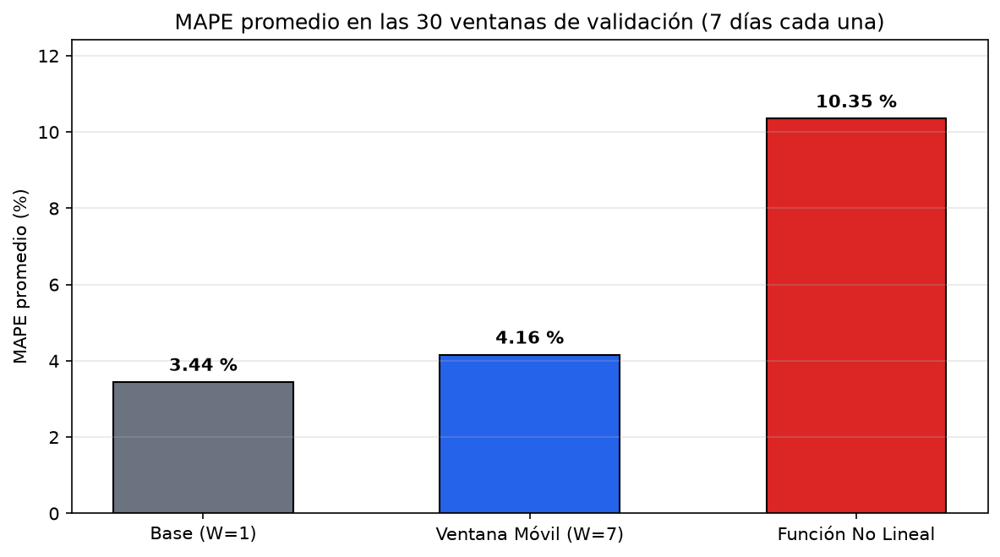
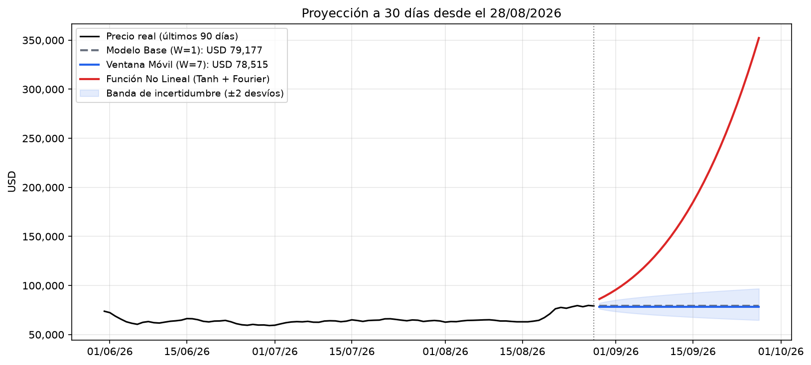

# Análisis BTC

**Análisis y pronóstico del precio de Bitcoin**

PROGRAMACIÓN FUNCIONAL · LICENCIATURA EN CIENCIA DE DATOS

*Modelado Matemático Funcional y Validación Temporal*

| | |
|---|---|
| **Alumnos** | Abraham Milena, Arguinzoniz Julieta, Juárez María Ailén, Muñoz Tadeo, Rossello Nicolás |
| **Comisión** | 70AT |
| **Trabajo práctico** | Análisis y pronóstico de BTC |
| **Fecha de entrega** | 18 de septiembre de 2026 |
| **Docente** | Javier Epeloa |

## Índice de secciones

| Número | Sección | Contenido |
|---|---|---|
| 1 | Introducción | Problema, datos y alcance |
| 2 | Objetivos | Resultados verificables esperados |
| 3 | Metodología | Pipeline y decisiones de diseño funcional |
| 4 | Resultados | Métricas y observaciones |
| 5 | Conclusiones | Respuesta a los objetivos |
| — | Anexos y referencias | Código y fuentes consultadas |

## 1 Introducción

En este trabajo buscamos analizar una serie temporal de 365 precios diarios de Bitcoin y comparar estrategias de pronóstico formuladas bajo el paradigma de Programación Funcional. El estudio contrasta dos modelos determinísticos frente a un modelo base ingenuo:

1. **Modelo de Ventana Móvil Local ($W=7$):** Estimador funcional basado en el promedio aritmético de una ventana deslizante de observaciones recientes, implementado como una reducción pura.
2. **Modelo No Lineal Paramétrico (Tanh + Fourier):** Ajuste global que combina una componente sigmoidea de saturación (tangente hiperbólica) con armónicos trigonométricos periódicos, resuelto mediante optimización por mínimos cuadrados.

Nuestro objetivo es aplicar conceptos de programación funcional al análisis de series de tiempo. Para no quedarnos solo con el ajuste sobre los datos conocidos, evaluamos los modelos paso a paso en el tiempo y los comparamos contra un modelo base ingenuo que simplemente repite el último precio registrado. El análisis es exploratorio y con fines pedagógicos.

## 2 Objetivos

### Objetivo general

Implementar y evaluar un pipeline de análisis y pronóstico de Bitcoin que integre conceptos de programación funcional, comparando un modelo de ventana móvil local y un modelo de ajuste no lineal global frente a un modelo de referencia ingenuo.

### Objetivos específicos

1. **Diagnóstico:** Analizar la estacionariedad mediante el test Augmented Dickey-Fuller (ADF), la autocorrelación serial y la volatilidad anual de la serie.
2. **Implementación funcional:** Construir los modelos garantizando inmutabilidad en las configuraciones, funciones de orden superior (closures), manejo funcional de errores (tipo `FitOutcome`) y acumulación monoidal vía `map`/`reduce`.
3. **Validación temporal:** Comparar el desempeño predictivo mediante validación temporal paso a paso sobre 30 ventanas expansivas con horizonte de 7 días, contrastando las diferencias mediante la prueba no paramétrica de Wilcoxon (con corrección de Bonferroni por las dos comparaciones).
4. **Evaluación de limitaciones:** Identificar las restricciones de extrapolar funciones determinísticas y discutir el efecto de promediar el pasado reciente ($W=7$ frente a $W=1$) en un proceso que se parece a un paseo aleatorio.

## 3 Metodología

### Datos y herramientas

El archivo `btc-timeseries.json` contiene 365 observaciones diarias consecutivas, desde el 29 de agosto de 2025 hasta el 28 de agosto de 2026, sin valores faltantes ni fechas repetidas (el notebook lo verifica). El notebook lo descarga de `github.com/number1angel/btc-funcional-analisis` si no está en disco. El precio diario se define como el punto medio entre el máximo y el mínimo del día: $P_t = \dfrac{\max_t + \min_t}{2}$. No es el precio de cierre, y promediar puede hacer que un día se parezca al siguiente más de lo que se parecería con el cierre.

El trabajo se desarrolló en Python 3.12 utilizando NumPy, pandas, Matplotlib, SciPy y statsmodels (las versiones exactas se imprimen en la primera celda del notebook), además de `functools`, `dataclasses` y `typing` de la librería estándar. No se usó scikit-learn ni modelos de Machine Learning, y las métricas de error (MAE, MAPE y RMSE) se implementaron a mano como funciones puras.

### Procedimiento

1. **Ingesta y preprocesamiento:** Cargar la serie temporal, validar la integridad del calendario y calcular los retornos logarítmicos diarios $r_t = \ln\!\left(\dfrac{P_t}{P_{t-1}}\right)$.
2. **Evaluación estadística:** Aplicar el test ADF sobre niveles y retornos, medir la volatilidad histórica (anualizada con 365 días, porque Bitcoin cotiza todos los días) y calcular la función de autocorrelación (ACF) hasta el lag 10.
3. **Estructuración de ventanas temporales:** Construir 30 ventanas expansivas con 150 días iniciales de entrenamiento, horizonte de pronóstico $h=7$ días y paso de avance $s=7$ días. Las ventanas cubren los días 0 a 359; los últimos 5 días de la serie no se evalúan. Los puntos de corte quedan en una tupla inmutable.
4. **Modelo Base ($W=1$):** Repetir el último precio conocido durante los 7 días.
5. **Modelo de Ventana Móvil ($W=7$):** Implementar una función pura que proyecta para el horizonte de prueba el promedio de los últimos $W$ días de la historia disponible. El promedio queda fijo: no se recalcula con sus propios pronósticos.
6. **Modelo No Lineal (Tanh + Fourier):** Ajustar mediante `curve_fit` la función paramétrica $f(u)=a_0+a_1\tanh\big(a_2(u-a_3)\big)+\sum_{k=1}^{K}\big[b_k\sin(\omega_k u)+c_k\cos(\omega_k u)\big]$, con $u=t/n$ ($n$ = cantidad de días de entrenamiento), $\omega_k = 2\pi k/P$ y $K=4$ armónicos: 12 parámetros en total. Se evalúan cinco períodos candidatos $P \in \{2,\ 1,\ 1/2,\ 1/3,\ 1/4\}$ (en unidades de $u$) y se selecciona el ajuste de menor error cuadrático medio (RMSE) sobre los datos de entrenamiento. Si ningún candidato converge, la función devuelve un `FitOutcome` de error en lugar de frenar el programa.
7. **Prueba de extrapolación:** Ajustar la función no lineal con los primeros 335 días y pronosticar los últimos 30, que no vio.
8. **Validación temporal paso a paso y comparación:** Evaluar las 30 ventanas sin bucles mutables (`map` y `reduce` sobre tuplas), medir MAE y MAPE, y contrastar significancia estadística con la prueba pareada y bilateral de Wilcoxon sobre el MAPE de cada ventana. Como se hacen dos comparaciones contra el mismo modelo base, se mira además el umbral corregido por Bonferroni: $0{,}05/2 = 0{,}025$.
9. **Extrapolación final:** Proyectar 30 días futuros con toda la serie disponible y construir una banda de incertidumbre de referencia calculada como $P_0 \exp(\pm 2\sigma\sqrt{h})$, donde $P_0$ es el último precio observado, $\sigma$ es el desvío estándar muestral de los retornos logarítmicos y $h \in \{1, \dots, 30\}$ es el horizonte en días. El factor 2 aproxima el valor crítico 1,96 de una distribución normal para un nivel del 95 %; no obstante, se presenta como una guía heurística basada en la dispersión histórica y no como un intervalo de predicción estadístico formal, asumiendo retornos independientes y volatilidad constante.

### Decisiones de diseño funcional

| Decisión | Opción elegida | Justificación en Programación Funcional |
|---|---|---|
| Configuración del sistema | Dataclasses congeladas (`frozen=True`) y tuplas | Garantiza inmutabilidad de la configuración y de los puntos de corte, y evita efectos colaterales durante el flujo. |
| Construcción del modelo no lineal | Fábrica de funciones y closures | Desacopla la especificación matemática de los coeficientes ajustados en memoria. Cada período candidato genera su propia función. |
| Manejo de errores de optimización | Tipo `FitOutcome` (un Functor: tiene `.map()` pero no `.flat_map()`, así que no es una Mónada) | Convierte las fallas de la optimización (`RuntimeError`, `ValueError`) en un valor y propaga éxito o falla con `.map()`. Hay un único `try/except`, en el punto donde `curve_fit` puede fallar, y solo atrapa errores de la optimización para no esconder bugs. |
| Evaluación de ventanas | Operadores `map` y `reduce` (y `filter` para quedarse con los ajustes que convergen) | Acumula los resultados inmutables (`FoldResult`) evitando listas mutables y `.append()`. Unir tuplas cumple las propiedades de un Monoid (la tupla vacía es el elemento neutro). |
| Cálculo de ventana móvil | Reducción pura sobre tuplas | Aplica transformaciones directas sobre subconjuntos inmutables de la historia. |

### Alcance funcional

El núcleo de ajuste, pronóstico y evaluación está formulado con funciones que reciben sus datos como parámetros y no modifican nada externo (en particular, `evaluate_fold` recibe la serie como arrays marcados de solo lectura). No es 100 % funcional en los bordes: la carga y preparación de los datos usan pandas, NumPy trabaja con arrays, y `make_model` usa un `for` que solo actualiza una variable local. Python no impide mutar, así que la inmutabilidad de los arrays depende de que se respete.

## 4 Resultados

### Resumen de ejecución

| Métrica | Valor | Observación |
|---|---|---|
| Registros de entrada | 365 | Serie diaria completa sin datos faltantes ni repetidos |
| Registros descartados | 0 | |
| Retornos calculados | 364 | El primer día no tiene día anterior |
| Ventanas planificadas | 30 | Horizonte de 7 días por ventana expansiva |
| Ventanas evaluadas | 30 | 100 % de convergencia en todas las ventanas (0 descartadas) |
| Leyes de Functor | 2 de 2 | Identidad y composición comprobadas con `assert`, sobre listas y sobre `FitOutcome` (con valores de prueba) |

### Diagnóstico de la serie temporal

| Indicador | Resultado | Lectura |
|---|---|---|
| ADF sobre precio | estadístico −1,704; p = 0,4292 | No se rechaza la raíz unitaria: no hay evidencia de que la serie de precios sea estacionaria. |
| ADF sobre log retornos | estadístico −6,423; p < 0,0001 (≈ 1,8·10⁻⁸) | Se rechaza la raíz unitaria: los retornos son estacionarios. |
| Volatilidad diaria | 1,84 % | Desvío estándar muestral de los log-retornos. |
| Volatilidad anualizada | 35,22 % | Aproximación convencional mediante $\sigma_{anual}=\sigma_{diaria}\cdot\sqrt{365}$. |
| Autocorrelación (orden 1) | 0,35 | Dependencia serial positiva de corto plazo en los retornos. Entre los lags 2 y 10 los valores van de −0,17 a 0,13. |

Como se observa en la Figura 1, el precio de Bitcoin atraviesa fases de suba y fuertes correcciones (máximo USD 124.614, mínimo USD 59.205, promedio USD 82.749), compatibles con una serie no estacionaria. En la Figura 2, los retornos logarítmicos fluctúan alrededor de una media cercana a cero (−0,09 % diario) y su distribución tiene colas pesadas (curtosis en exceso de 3,18; una normal daría 0), y el test ADF indica que son estacionarios.

*Figura 1: Evolución temporal del precio diario de Bitcoin (2025–2026)*

*Figura 2: Rendimientos logarítmicos diarios e histograma de distribución*

### Comparación de modelos

| Modelo evaluado | MAE promedio (USD) | MAPE promedio (%) | MAPE mediano (%) | Ventanas en que el base tuvo menor MAPE | Wilcoxon vs. Modelo Base |
|---|---|---|---|---|---|
| Modelo Base Ingenuo (Persistencia, $W=1$) | 2.392,70 | 3,44 % | 2,54 % | — | — (punto de referencia) |
| Modelo de Ventana Móvil ($W=7$) | 2.899,27 | 4,16 % | 2,84 % | 18 de 30 | p = 0,0473 (significativo al 0,05; no supera el umbral corregido de 0,025) |
| Función No Lineal (Tanh + Fourier) | 7.038,21 | 10,35 % | 8,62 % | 25 de 30 | p ≈ 8·10⁻⁶ (< 0,0001; significativo también con la corrección) |

### Salidas y observaciones

**Sobreajuste de la función no lineal:** La función alcanzó un MAPE de 3,11 % sobre los 335 días con los que se ajustó, pero su error aumentó a 64,02 % al pronosticar los 30 días finales, que no vio (Figura 3): unas 20 veces más (MAE de USD 2.501 a USD 44.893; RMSE de USD 3.276 a USD 50.898). Como la tangente hiperbólica, el seno y el coseno son funciones acotadas, esa divergencia solo es posible con coeficientes muy grandes que se compensan entre sí dentro de los datos: en el ajuste de 335 días $a_0$ es de USD 330.742 y los coeficientes de los armónicos llegan a 427.232, frente a un precio máximo de USD 124.614 (con los 365 días llegan a 13.408.950). Fuera de la muestra esa compensación se rompe y la curva se dispara. Solo $a_2$ y $a_3$ tienen límites en el ajuste; los demás parámetros no.

*Figura 3: Ajuste sobre datos conocidos vs. extrapolación a 30 días de la función no lineal*

**Desempeño en la validación temporal paso a paso:** En las 30 ventanas evaluadas (Figura 4), el modelo base ingenuo tuvo menor error que la ventana móvil de 7 días (MAPE promedio 3,44 % frente a 4,16 %; mediana 2,54 % frente a 2,84 %) y ganó en 18 de las 30 ventanas. El p-valor de Wilcoxon (p = 0,0473) está por debajo de 0,05 pero no supera el umbral corregido de 0,025, así que es una evidencia débil, no concluyente. Una explicación posible, que no pudimos comprobar con estos datos, es que si el precio se comporta como un paseo aleatorio, promediar el pasado reciente introduce un retraso (inercia) frente al dato más inmediato. Contra la función no lineal (10,35 %) la diferencia es clara: el base ganó en 25 de las 30 ventanas y p ≈ 8·10⁻⁶.

*Figura 4: Comparación de MAPE promedio en validación temporal paso a paso*

**Extrapolación final a 30 días:** En la proyección hacia el futuro (Figura 5), el modelo base y la ventana móvil trazan trayectorias horizontales (USD 79.176,55 y USD 78.515,01 respectivamente) y se mantienen dentro de la banda de referencia basada en $P_0 \exp(\pm 2\sigma\sqrt{h})$ los 30 días; en el caso del base, por construcción, al proyectar $P_0$ de forma constante. La banda en el día 30 va de USD 64.698 a USD 96.895. La función no lineal parte de USD 86.249,93 el día 1 y llega a USD 352.181,91 el día 30 (4,45 veces el último precio), y queda fuera de la banda los 30 días.

*Figura 5: Extrapolación final a 30 días con banda de incertidumbre empírica $P_0 \exp(\pm 2\sigma\sqrt{h})$*

## 5 Conclusiones

- **Cumplimiento del diagnóstico estocástico:** El test ADF no dio evidencia de que el precio de BTC sea estacionario (p = 0,4292), mientras que los retornos logarítmicos sí lo son (p < 0,0001). Esto es coherente con usar "repetir el último precio" como punto de comparación y con que las curvas determinísticas rígidas fallen al extrapolar. La autocorrelación de 0,35 a un día indica que los retornos no son completamente aleatorios; parte puede venir de que el precio es un promedio (máx+mín)/2 del día, que suaviza la serie.
- **Validación del paradigma funcional:** Se implementó el pipeline con dataclasses congeladas, closures, acumulación con `reduce` y un tipo `FitOutcome` con `.map()` (un Functor; no es una Mónada porque no tiene `.flat_map()`), y se comprobaron con `assert` las dos leyes de Functor sobre listas y sobre `FitOutcome`. Los límites son los ya mencionados: pandas y NumPy, el `for` local de `make_model`, y que en Python la inmutabilidad de los arrays depende de que se respete.
- **Análisis comparativo de modelos:** El modelo base ingenuo ($W=1$) tuvo el menor error, tanto en promedio (MAPE 3,44 %) como en mediana (2,54 %). Contra la función no lineal (10,35 %) la diferencia es clara (p ≈ 8·10⁻⁶, y el base ganó en 25 de 30 ventanas). Contra la ventana móvil de 7 días (4,16 %) la diferencia es reducida: p = 0,0473 no supera el umbral corregido de 0,025 y el base ganó en 18 de 30 ventanas, así que la tomamos como evidencia débil.
- **Lección metodológica:** Un excelente ajuste sobre los datos conocidos no garantiza capacidad predictiva fuera de la muestra: la función no lineal pasó de un MAPE de 3,11 % sobre los datos con los que se ajustó a 64,02 % sobre 30 días que no vio.
- **Limitaciones:** Usamos un solo activo y un solo año. Treinta ventanas son pocas para detectar diferencias de pequeña magnitud, y las ventanas consecutivas no son independientes entre sí. Probamos un solo tamaño de ventana móvil. El precio es un promedio del día y no el cierre. La banda de incertidumbre supone volatilidad constante y retornos independientes.
- **Trabajo futuro:** Probar otros tamaños de ventana, explorar suavizados exponenciales adaptativos y agregar `.flat_map()` a `FitOutcome` para implementar la Mónada Either completa en el manejo algebraico de errores.

## Anexos y referencias

### Anexo A · Código fuente

El código completo, los experimentos y las visualizaciones se encuentran en el archivo del proyecto `BTC_Analysis.ipynb`.

### Referencias

- Apuntes de cátedra de Programación Funcional, Unidades I a IV (Docente Javier Epeloa).
- Datos: `btc-timeseries.json`, repositorio `github.com/number1angel/btc-funcional-analisis`.
- Python Software Foundation. Documentación oficial de Python 3, `dataclasses` y `functools`.
- SciPy Community. Documentación de `scipy.optimize.curve_fit` y `scipy.stats.wilcoxon`.
- statsmodels Developers. Documentación de `adfuller` y `acf`.
- Dickey, D. A. y Fuller, W. A. (1979). Distribution of the Estimators for Autoregressive Time Series With a Unit Root. *Journal of the American Statistical Association*, 74(366), 427–431.
- Wilcoxon, F. (1945). Individual Comparisons by Ranking Methods. *Biometrics Bulletin*, 1(6), 80–83.
- Asistencia de modelos de lenguaje (LLM). Herramienta de consulta exclusiva para sintaxis y depuración de código; el desarrollo conceptual, estructuración del informe y redacción final fueron elaborados íntegramente por los integrantes del equipo.

*Fin del informe técnico.*
